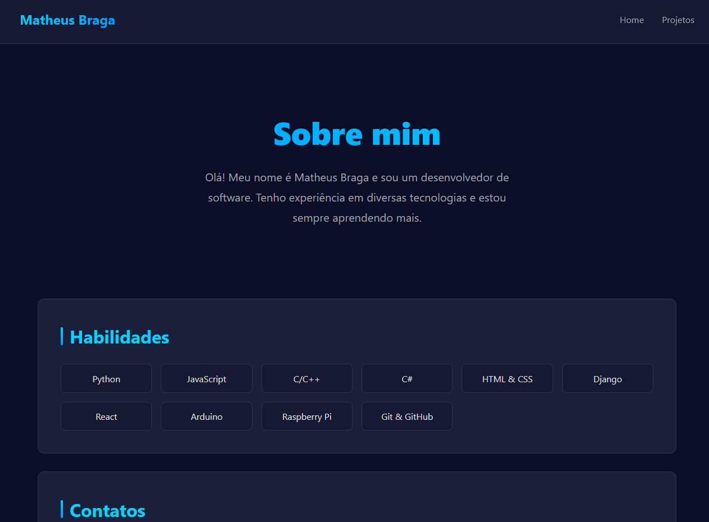

# Meu Primeiro Site com Django



Este é um projeto simples de um site de portfólio desenvolvido com o framework web Django. O objetivo deste projeto é demonstrar as habilidades básicas de desenvolvimento web com Python e Django, criando um site que lista projetos e exibe seus detalhes.

## Funcionalidades

*   **Página Inicial:** Uma página de boas-vindas.
*   **Lista de Projetos:** Uma página que exibe uma lista de projetos.
*   **Detalhes do Projeto:** Uma página que mostra informações detalhadas sobre um projeto específico.

## Tecnologias Utilizadas

*   **Backend:**
    *   Python
    *   Django
*   **Frontend:**
    *   HTML5

## Estrutura do Projeto

O projeto está organizado da seguinte forma:

*   `core/`: Contém as configurações principais do projeto Django.
*   `portfolio/`: É o aplicativo Django que contém a lógica do site do portfólio.
    *   `templates/`: Contém os templates HTML do site.
    *   `views.py`: Contém as views que renderizam as páginas.
    *   `urls.py`: Define as rotas do aplicativo.
    *   `dados.py`: Armazena os dados dos projetos em um dicionário Python.

## Como Executar o Projeto

Para executar este projeto em seu ambiente local, siga os passos abaixo:

1.  **Clone o repositório:**

    ```bash
    git clone https://github.com/seu-usuario/django-first-website.git
    cd django-first-website
    ```

2.  **Crie e ative um ambiente virtual:**

    ```bash
    python -m venv venv
    source venv/bin/activate  # No Windows, use `venv\Scripts\activate`
    ```

3.  **Instale as dependências:**

    Como não há um arquivo `requirements.txt`, você precisará instalar o Django manualmente:

    ```bash
    pip install Django
    ```

4.  **Execute o servidor de desenvolvimento:**

    ```bash
    python manage.py runserver
    ```

5.  **Acesse o site:**

    Abra seu navegador e acesse `http://127.0.0.1:8000/`.

## Páginas

*   **Página Inicial:** `http://127.0.0.1:8000/`
*   **Projetos:** `http://127.0.0.1:8000/projetos/`
*   **Detalhes do Projeto:** `http://127.0.0.1:8000/projetos/<id_do_projeto>/` (ex: `/projetos/projeto1/`)